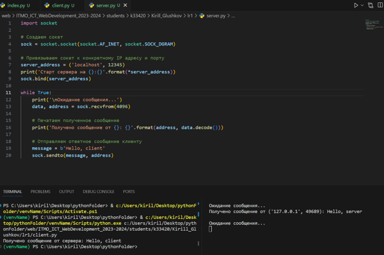

**Задание:** реализовать клиентскую и серверную часть приложения. Клиент отсылает серверу сообщение «Hello, server». Сообщение должно отразиться на стороне сервера.
Сервер в ответ отсылает клиенту сообщение «Hello, client». Сообщение должно отобразиться у клиента.
Обязательно использовать библиотеку socket. Реализовать с помощью протокола UDP.

**Листинг кода сервера:**
```python
import socket
import math

# Create a TCP socket
sock = socket.socket(socket.AF_INET, socket.SOCK_STREAM)

# Bind the socket to a specific IP address and port
server_address = ('localhost', 12345)
print('Starting the server on {}:{}'.format(*server_address))
sock.bind(server_address)

while True:
    print('\nОжидание сообщениея...')
    data, adress = sock.recvfrom(4096)

    print('Получено сообщение от {}: {}'.format(adress, data.decode()))
    message = b'Hello, client'
    sock.sendto(message, adress)


```

**Листинг кода клиента:**
```python
import socket


sock = socket.socket(socket.AF_INET, socket.SOCK_STREAM)


message = b'Hello, server'
server_address = ('localhost', 12345)
sock.sendto(message, server_address)

data, _ = sock.recvfrom(4096)
print('Получено сообщение от сервера:', data.decode())

sock.close()
```

**Скринкаст:**

Клиент-серверное взаимодействие:
