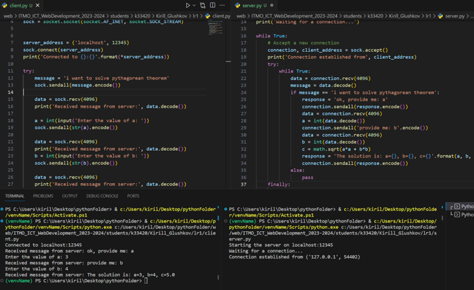

**Задание:** реализовать клиентскую и серверную часть приложения. Клиент запрашивает у сервера выполнение математической операции, параметры, которые вводятся с клавиатуры. Сервер обрабатывает полученные данные и возвращает результат клиенту. 

Варианты:

a. Теорема Пифагора

b. Решение квадратного уравнения.

c. Поиск площади трапеции.

d. Поиск площади параллелограмма.

Вариант выбирается в соответствии с порядковым номером в журнале. Пятый студент получает вариант 1 и т.д. 
Обязательно использовать библиотеку socket. Реализовать с помощью протокола TCP.

Мой вариант - b. Функция для решения квадратного уравнения снабжена доктестами для проверки её работы.

**Листинг кода сервера:**
```python
import socket
import math

# Create a TCP socket
sock = socket.socket(socket.AF_INET, socket.SOCK_STREAM)

# Bind the socket to a specific IP address and port
server_address = ('localhost', 12345)
print('Starting the server on {}:{}'.format(*server_address))
sock.bind(server_address)

# Listen for incoming connections
sock.listen(1)
print('Waiting for a connection...')

while True:
    # Accept a new connection
    connection, client_address = sock.accept()
    print('Connection established from', client_address)
    try:
        while True:
            data = connection.recv(4096)
            message = data.decode()
            if message == 'i want to solve pythagorean theorem':
                response = 'ok, provide me: a'
                connection.sendall(response.encode())
                data = connection.recv(4096)
                a = int(data.decode())
                connection.sendall('provide me: b'.encode())
                data = connection.recv(4096)
                b = int(data.decode())
                c = math.sqrt(a*a + b*b)
                response = 'The solution is: a={}, b={}, c={}'.format(a, b, c)
                connection.sendall(response.encode())
            else:
                pass
    finally:
        connection.close()
```

**Листинг кода клиента:**
```python
import socket


sock = socket.socket(socket.AF_INET, socket.SOCK_STREAM)


server_address = ('localhost', 12345)
sock.connect(server_address)
print('Connected to {}:{}'.format(*server_address))

try:
    message = 'i want to solve pythagorean theorem'
    sock.sendall(message.encode())

    data = sock.recv(4096)
    print('Received message from server:', data.decode())

    a = int(input('Enter the value of a: '))
    sock.sendall(str(a).encode())

    data = sock.recv(4096)
    print('Received message from server:', data.decode())
    b = int(input('Enter the value of b: '))
    sock.sendall(str(b).encode())

    data = sock.recv(4096)
    print('Received message from server:', data.decode())

finally:
    sock.close()
```

**Скринкаст:**

Клиент-серверное взаимодействие:
