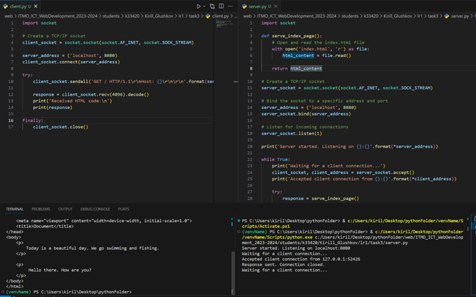

**Задание:** реализовать серверную часть приложения. Клиент подключается к серверу. В ответ клиент получает http-сообщение, содержащее html-страницу, которую сервер подгружает из файла index.html.

В рамках данного задания для проверки работоспособности была также реализована клиентская сторона.

**Листинг кода сервера:**
```python
import socket

def serve_index_page():
    # Open and read the index.html file
    with open('index.html', 'r') as file:
        html_content = file.read()

    return html_content

# Create a TCP/IP socket
server_socket = socket.socket(socket.AF_INET, socket.SOCK_STREAM)

# Bind the socket to a specific address and port
server_address = ('localhost', 8080)
server_socket.bind(server_address)

# Listen for incoming connections
server_socket.listen(1)

print('Server started. Listening on {}:{}'.format(*server_address))

while True:
    print('Waiting for a client connection...')
    client_socket, client_address = server_socket.accept()
    print('Accepted client connection from {}:{}'.format(*client_address))

    try:
        response = serve_index_page()
        client_socket.sendall(response.encode())

        # Close the connection
        client_socket.close()
        print('Response sent. Connection closed.')

    except Exception as e:
        print('An error occurred: {}'.format(e))
```

**Листинг кода клиента:**
```python
import socket

# Create a TCP/IP socket
client_socket = socket.socket(socket.AF_INET, socket.SOCK_STREAM)

server_address = ('localhost', 8080)
client_socket.connect(server_address)

try:
    client_socket.sendall('GET / HTTP/1.1\r\nHost: {}\r\n\r\n'.format(server_address[0]).encode())

    response = client_socket.recv(4096).decode()
    print('Received HTML code:\n')
    print(response)

finally:
    client_socket.close()
```

**Скринкаст:**

Клиент-серверное взаимодействие:

