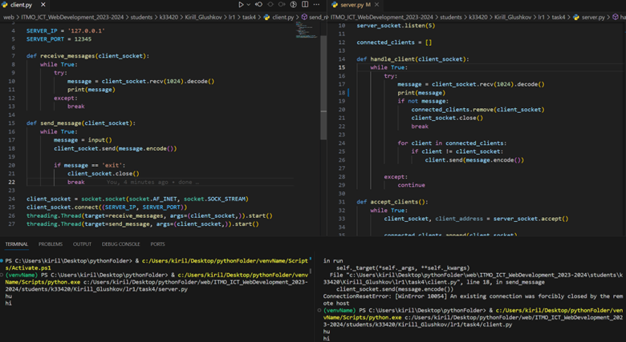

**Задание:** Реализовать двухпользовательский или многопользовательский чат. Реализация многопользовательского часа позволяет получить максимальное количество баллов.
Обязательно использовать библиотеку (не отображается в ТЗ).
Реализовать с помощью протокола TCP – 100% баллов, с помощью UDP – 80%. 
Обязательно использовать библиотеку threading.
Для реализации с помощью UDP, thearding использовать для получения сообщений у клиента.
Для применения с TCP необходимо запускать клиентские подключения, прием и отправку сообщений всем юзерам на сервере в потоках. Не забудьте сохранять юзеров, чтобы потом отправлять им сообщения.

Мной был реализован многопользовательский чат с помощью протокола TCP.

**Листинг кода сервера:**
```python
import socket
import threading

# Define constants for server IP address and port
SERVER_IP = '127.0.0.1'
SERVER_PORT = 12345

server_socket = socket.socket(socket.AF_INET, socket.SOCK_STREAM)
server_socket.bind((SERVER_IP, SERVER_PORT))
server_socket.listen(5)

connected_clients = []

def handle_client(client_socket):
    while True:
        try:
            message = client_socket.recv(1024).decode()
            print(message)
            if not message:
                connected_clients.remove(client_socket)
                client_socket.close()
                break
            
            for client in connected_clients:
                if client != client_socket:
                    client.send(message.encode())
        
        except:
            continue

def accept_clients():
    while True:
        client_socket, client_address = server_socket.accept()

        connected_clients.append(client_socket)

        threading.Thread(target=handle_client, args=(client_socket,)).start()

threading.Thread(target=accept_clients).start()
```

**Листинг кода клиента:**
```python
import socket
import threading

SERVER_IP = '127.0.0.1'
SERVER_PORT = 12345

def receive_messages(client_socket):
    while True:
        try:
            message = client_socket.recv(1024).decode()
            print(message)
        except:
            break

def send_message(client_socket):
    while True:
        message = input()
        client_socket.send(message.encode())

        if message == 'exit':
            client_socket.close()
            break

client_socket = socket.socket(socket.AF_INET, socket.SOCK_STREAM)
client_socket.connect((SERVER_IP, SERVER_PORT))
threading.Thread(target=receive_messages, args=(client_socket,)).start()
```

**Скринкаст:**

Клиент-серверное взаимодействие:
