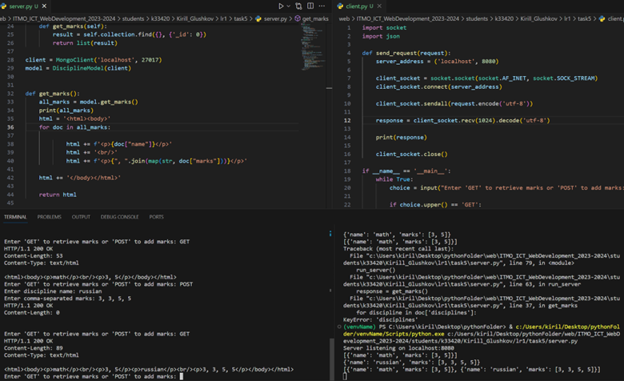
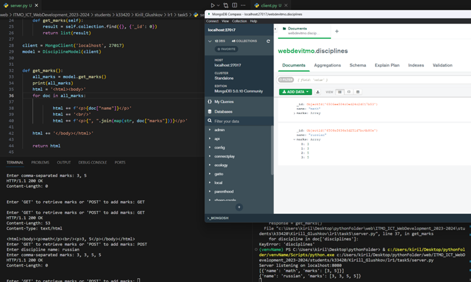

**Задание:** необходимо написать простой web-сервер для обработки GET и POST http
запросов средствами Python и библиотеки socket.

Базовый класс для простейшей реализации web-сервера доступен
https://docs.google.com/document/d/1lv_3D9VtMxz8tNkA6rA1xu9zaWEIBGXiLWBo1cse-
0k/edit?usp=sharing

Подробный мануал по работе доступен https://iximiuz.com/ru/posts/writing-python-web-server-part-3/

Задание: сделать сервер, который может:

* Принять и записать информацию о дисциплине и оценке по дисциплине.

* Отдать информацию обо всех оценах по дсициплине в виде html-страницы.

Мой код в данном задании по большей части представляет собой копипаст кода из приведенного выше мануала с некоторыми дополнениями.

**Листинг кода сервера:**
```python
import socket
import json
from pymongo import MongoClient


class DisciplineModel:
    def __init__(self, client):
        self.client = client
        self.db = self.client['webdevitmo']
        self.collection = self.db['disciplines']

    def add_marks(self, discipline_name, marks):
        discipline = self.collection.find_one({'name': discipline_name})
        if discipline:
            self.collection.update_one(
                {'name': discipline_name},
                {'$push': {'marks': {'$each': marks}}},
            )
        else:
            self.collection.insert_one(
                {'name': discipline_name, 'marks': marks}
            )

    def get_marks(self):
        result = self.collection.find({}, {'_id': 0})
        return list(result)

client = MongoClient('localhost', 27017)
model = DisciplineModel(client)


def get_marks():
    all_marks = model.get_marks()
    print(all_marks)
    html = '<html><body>'
    for doc in all_marks:

            html += f'<p>{doc["name"]}</p>'
            html += '<br/>'
            html += f'<p>{", ".join(map(str, doc["marks"]))}</p>'
    
    html += '</body></html>'
    
    return html


def run_server():
    server_address = ('localhost', 8080)
    
    server_socket = socket.socket(socket.AF_INET, socket.SOCK_STREAM)
    server_socket.bind(server_address)
    server_socket.listen(1)
    
    print(f'Server listening on {server_address[0]}:{server_address[1]}')
    
    while True:
        client_socket, addr = server_socket.accept()
        
        request = client_socket.recv(1024).decode('utf-8') 
        
        if 'GET /marks HTTP/1.1' in request:
            # гет запрос на получение оценок
            response = get_marks()
            http_response = f"HTTP/1.1 200 OK\r\nContent-Length: {len(response)}\r\nContent-Type: text/html\r\n\r\n{response}"
            client_socket.sendall(http_response.encode('utf-8'))
        elif 'POST /add_marks HTTP/1.1' in request:
            # обрабатываем запрос на добавление оценки
            data = json.loads(request.split('\r\n')[-1])
            discipline_name = data['name']
            marks = data['marks']
            print(data)
            model.add_marks(discipline_name, marks)
            http_response = "HTTP/1.1 200 OK\r\nContent-Length: 0\r\n\r\n"
            client_socket.sendall(http_response.encode('utf-8'))
        
        client_socket.close()

if __name__ == '__main__':
    run_server()

```

**Листинг кода клиента:**
```python

import socket
import json
import webbrowser
import os
def send_request(request):
    server_address = ('localhost', 8080)
    
    client_socket = socket.socket(socket.AF_INET, socket.SOCK_STREAM)
    client_socket.connect(server_address)
    
    client_socket.sendall(request.encode('utf-8'))
    
    response = client_socket.recv(1024).decode('utf-8')
    
    print(response)
    with open('response.html', 'w') as f:
        f.write(response)
    
    webbrowser.open('file://' + os.path.realpath('response.html'))
    client_socket.close()

if __name__ == '__main__':
    while True:
        choice = input("Enter 'GET' to retrieve marks or 'POST' to add marks: ")

        if choice.upper() == 'GET':
            request = "GET /marks HTTP/1.1\r\n\r\n"
        elif choice.upper() == 'POST':
            name = input("Enter discipline name: ")
            marks_str = input("Enter comma-separated marks: ")
            marks = [int(mark) for mark in marks_str.split(',')]
            data = {'name': name, 'marks': marks}
            request_data = json.dumps(data)
            request = f"POST /add_marks HTTP/1.1\r\nContent-Length: {len(request_data)}\r\nContent-Type: application/json\r\n\r\n{request_data}"
        else:
            continue
        
        send_request(request)
```
**Скринкаст:**

Стартовая страница:

Страница добавления оценки:

